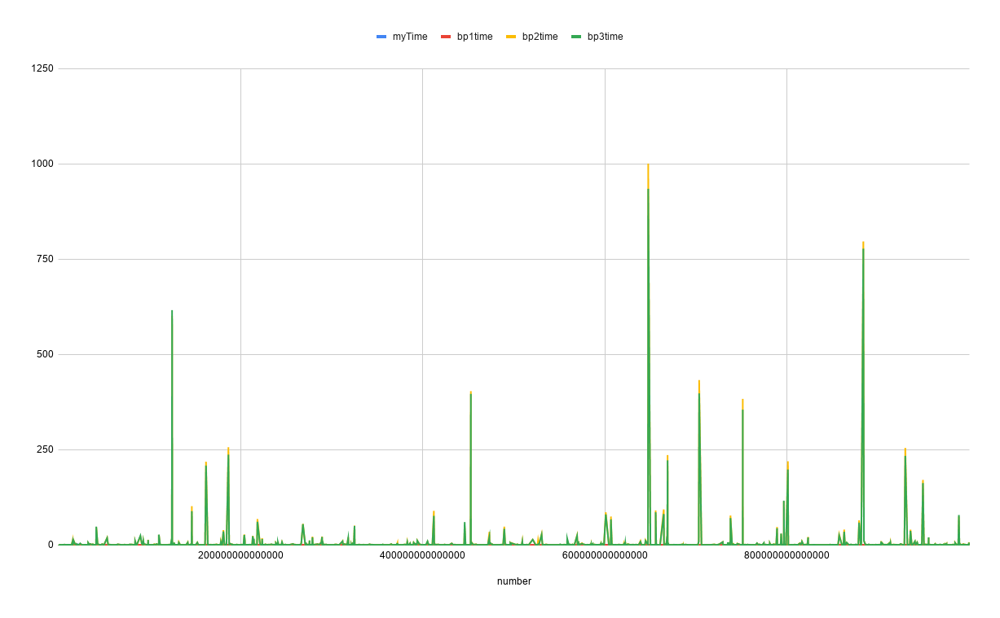
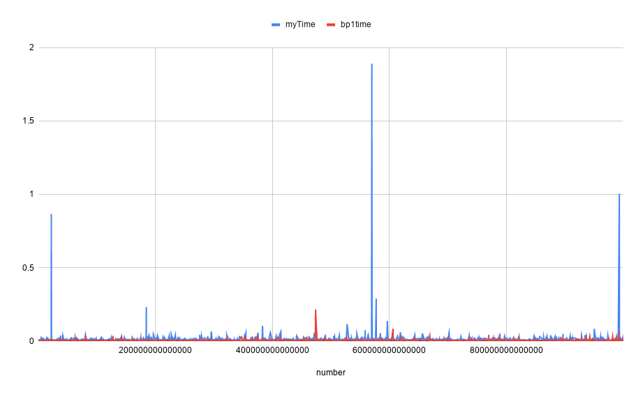
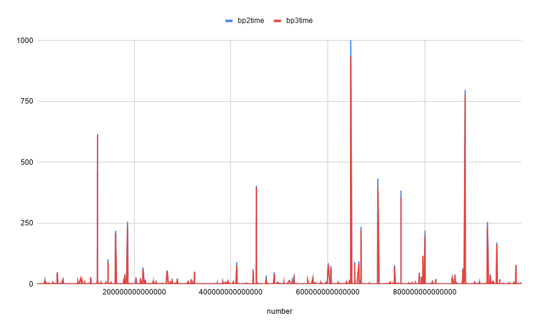

# Find next bigger kata code performance

After playing in codewars with [find-next-bigger](https://www.codewars.com/kata/55983863da40caa2c900004e/solutions/javascript) kata, I wanted to test my solution against the most voted ones.

In this repo there are files with the 3 first solutions sorted by best practices votes and my personal solution.

This code runs 1000 iterations with random numbers up to 1000000000000000, and measures the ms it takes every solution to solve the problem.

Then, json is [converted to csv](https://www.convertcsv.com/json-to-csv.htm) and some graphs are generated in google sheets.

# General results

This graph represents the time duration (vertical axis, ms) vs the number (horizontal axis).

The very first thing to notice, is that we cannot see the lines for the most-voted solution and my solution, only for the second and third best practices solutions, but, if we zoom on the bottom:

With this graph we can clearly see that the most voted solution is the most efficient one. These are the numbers:

|         | myTime  | bp1time | bp2time | bp3time |
|---------|---------|---------|---------|---------|
| average |	0.0171	| 0.0054  | 7.5674  | 7.1526  |
| max     |	1.8916	| 0.2143  | 1000.80 | 934.479 |
| min     |	0.0045	| 0.0023  | 0.0155  | 0.0138  |

There are two groups of solutions, _most voted and my solution_ and _second and third most voted_. Both groups offer similar results.

## Fist group

Most voted solution is clearly the most efficient one.

## Second group 

