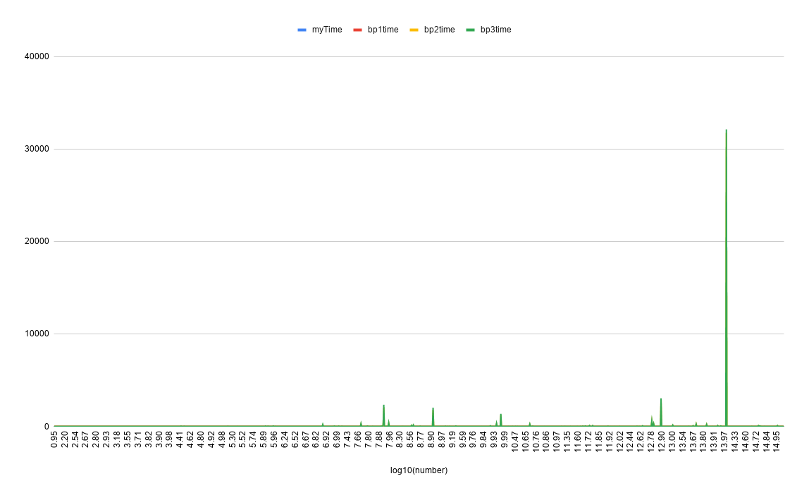
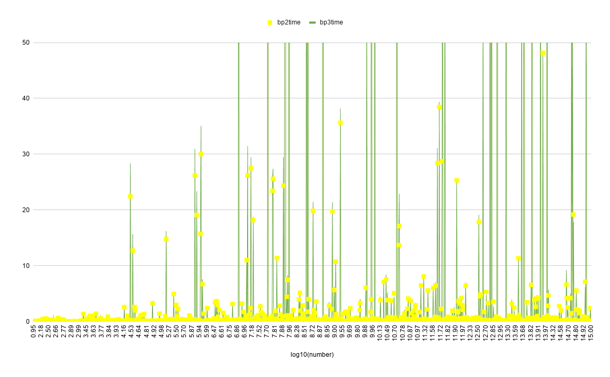

# Find next bigger kata code performance

After playing in codewars with [find-next-bigger](https://www.codewars.com/kata/55983863da40caa2c900004e/javascript) kata, I wanted to measure the efficiency of my solution and the most voted ones.

In this repo there are files with the 3 most voted solutions (copy pasted) and my personal solution.

This code (_randomData.js_) runs **N_TESTS** iterations with random numbers up to 1015, (currently 23500 aprox, altough graphs have been generated with partial data) and measures the ms it takes every solution to solve the problem.

Then, data is saved in csv and some graphs are generated in google sheets.

# Random results

This graph represents the time duration (vertical axis, ms) vs the number (horizontal axis).

The very first thing to notice, is that we cannot see the lines for the most-voted solution and my solution, only for the second and third best practices solutions, but, if we zoom on the bottom:

With this graph we can clearly see that the most voted solution is the most efficient one. These are the numbers:

|         | myTime  | bp1time | bp2time | bp3time |
|---------|---------|---------|---------|---------|
| average |	0.0171	| 0.0054  | 7.5674  | 7.1526  |
| max     |	1.8916	| 0.2143  | 1000.80 | 934.479 |
| min     |	0.0045	| 0.0023  | 0.0155  | 0.0138  |

There are two groups of solutions:

- _bp1_ and _my solution_
  - 
- _bp2_ and _bp3 solution_ 
  - 

Solutions in each group offer similar time - averages.

# Mapped results

To do a better analysis, a new dataset is generated by taking 100 random samples (if possible) of each range:  

Data stored in _cleanData.csv_ is plotted representing **time vs log(n)** in Google Sheets:

## General view

## First group

## Second group

# Conclussions

| (ms) | myTime | bp1time | bp2time    | bp3time      |
|------|--------|---------|------------|--------------|
|max   | 0.1848 | 0.0527  | 31741.5629 | 32115.3833   |
|min   | 0.002  | 0.0007  | 0.0011     | 0.0008       |

- _bp1_ algorithm is the most efficient.
- _bp2_ and _bp3_ work fine for some numbers, but time dispersion is much greater,
   being over 600000 times slower than the other algorithms for some numbers.

## Tuff numbers

| number           | solution           | fastest time | slowest time |
|----------------- |--------------------|--------------|--------------|
| 96577159988222   |	96577182225899	| 0.004        | 32115.383    |
| 847764787665110  |	847764801156677	| 0.013        | 23511.192    |
| 768534108332000  |	768534120000338	| 0.009        | 20748.610    |
| 485558415554332  |	485558421334555	| 0.005        | 9424.459     |
| 472631460766550  |	472631465005667	| 0.004        | 7340.659     |
| 972724937643331  |	972724941333367	| 0.006        | 6102.624     |
| 623769341665110  |	623769345011166	| 0.006        | 5868.842     |
| 946426385999550  |	946426389055599	| 0.008        | 5402.488     |
| 11202952888600   |	11202956002888	| 0.007        | 5290.968     |
| 40867965999950   |	40867969055999	| 0.005        | 4709.826     |
| 850159618555321  |	850159621135558	| 0.011        | 4626.497     |
| 148358594777322  |	148358597223477	| 0.012        | 4144.159     |
| 337577991888774  |	337577994177888	| 0.007        | 4021.334     |
| 311538430864333  |	311538433033468	| 0.007        | 3728.280     |
| 360447903887610  |	360447906013788	| 0.008        | 3669.509     |
| 443966360964430  |	443966363004469	| 0.007        | 3408.735     |
| 141256372885000  |	141256375000288	| 0.006        | 3518.536     |
| 504911505998520  |	504911508025599	| 0.010        | 3646.880     |
| 77390027500      |	7739005000027	| 0.005        | 3030.998     |
| 654012356998865  |	654012358566899	| 0.020        | 2742.651     |
| 457719730732000  |	457719732000037	| 0.007        | 2516.631     |
| 8255552          |    85225555        | 0.003	       | 2339.341     |
| 105564407942221  |	105564409122247	| 0.007        | 2524.594     |
| 276858655997774  |	276858657457799	| 0.020        | 2347.382     |
| 26507196998844   |	26507198446899	| 0.007        | 2232.965     |
| 57737272886644   |	57737274246688	| 0.004        | 2182.414     |
| 8328665          |    835002668       | 0.004	       | 2018.923     |
| 559802942765400  |	559802944002567	| 0.007        | 2288.175     |
| 532501111866633  |	532501113136668	| 0.006        | 2112.772     |
| 701067390876220  |	701067392002678	| 0.004        | 2556.468     |
| 868583487965441  |	868583489144567	| 0.006        | 1925.370     |
| 93371638885      |	9337165113888	| 0.007        | 1766.392     |
| 9516988222       |    9518222689      | 0.005        | 1354.434     |
| 726831781332220  |	726831782012233	| 0.004        | 1281.997     |
| 720192932443311  |	720192933112344	| 0.006        | 1181.003     |
| 89763473433331   |	89763474133333	| 0.007        | 1045.382     |
| 381270322299900  |	381270322900299	| 0.007        | 1207.582     |
| 169647465652222  |	169647466222255	| 0.006        | 1034.101     |

